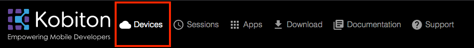
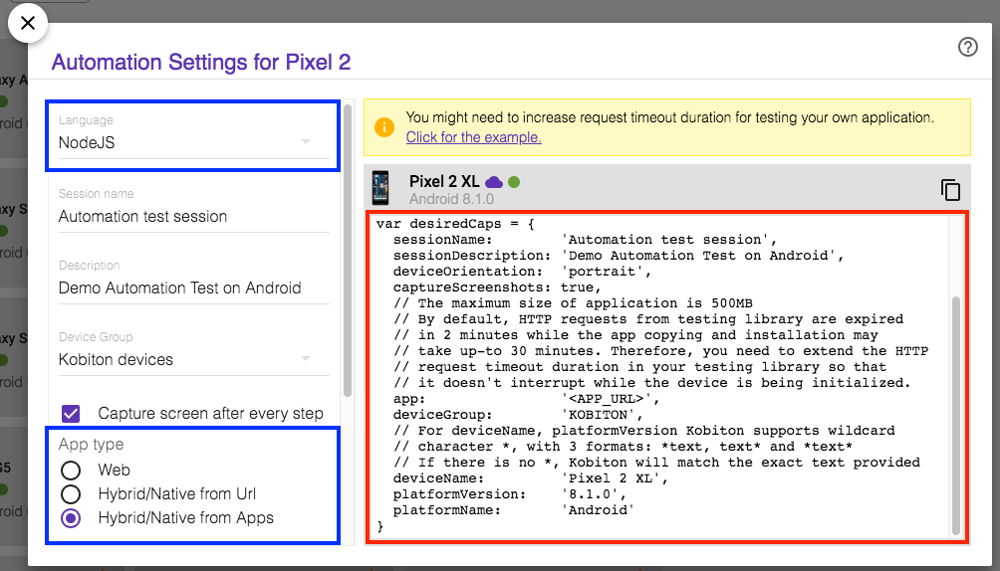
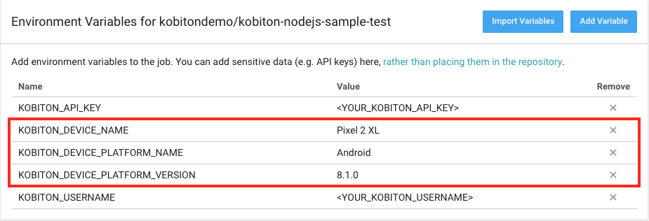
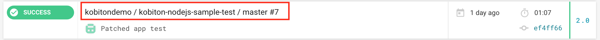
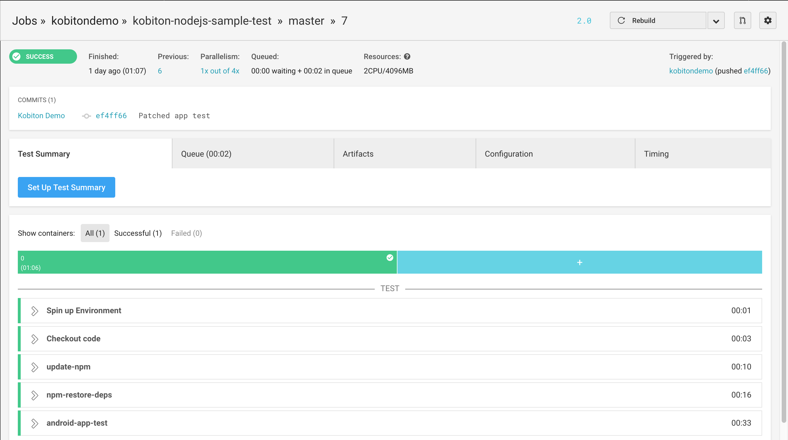
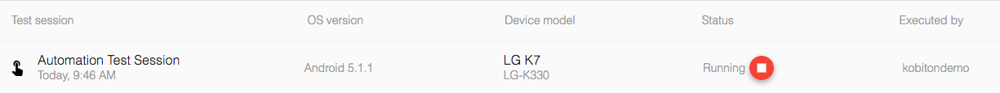
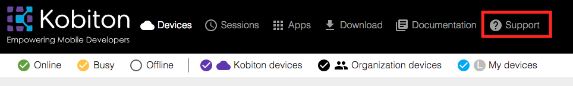
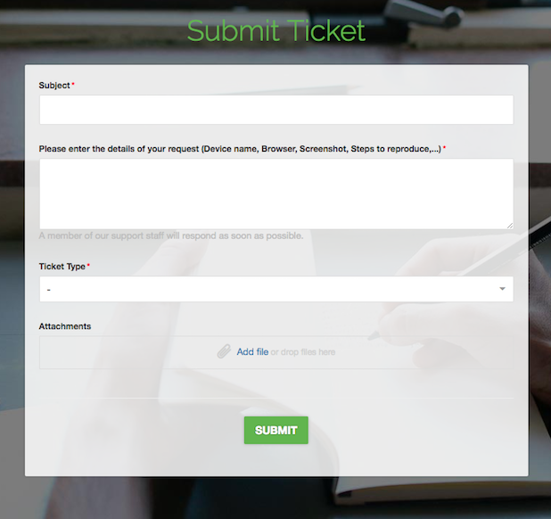

# Run Kobiton Automation Test on CircleCI

This document will guide you how to use CircleCI to execute automation test on Kobiton devices everytime you push a commit to GitHub.

## Table of contents
- [A. Preparation](#a-preparation)
    - [1. Prerequisites](#1-prerequisites)
    - [2. Getting Kobiton Username and API key](#2-getting-kobiton-username-and-api-key)
    - [3. Samples](#3-samples)
- [B. Setup](#b-setup)
    - [Purposes](#purposes)
    - [1. Setting Kobiton Username and API Key](#1-setting-kobiton-username-and-api-key)
    - [2. Getting Kobiton device desired capabilities](#2-getting-kobiton-device-desired-capabilities)
    - [3. Setting desired capabilities](#3-setting-desired-capabilities)
    - [4. CircleCI configuration file](#4-circleci-configuration-file)
    - [5. Configuring HockeyApp WebHook listener](#5-configuring-hockeyapp-webhook-listener)
- [C. Execution](#c-execution)
    - [1. Executing the automation test](#1-executing-the-automation-test)
    - [2. Fetching test session data using Kobiton REST API](#2-fetching-test-session-data-using-kobiton-rest-api)
- [D. Feedback](#d-feedback)

## A. Preparation

### 1. Prerequisites
- A server for receiving WebHooks.
    - Can be virtual, bare-metal or container, etc.
    - **MUST** be visible to the internet.
    - Has Ruby 2.x installed.
    > If you haven't installed Ruby on your server, please refer to [Ruby Installation documentation](https://www.ruby-lang.org/en/documentation/installation/) on how to install Ruby on corresponding OSes.
    
### 2. Getting Kobiton Username and API key
Kobiton Username and API key are required for authenticating with Kobiton.

> If you don't have a Kobiton account, visit https://portal.kobiton.com/register to create one.

To get your Kobiton Username and API Key, follow instruction at `IV. Configure Test Script for Kobiton` section on [our blog article](https://kobiton.com/blog/tutorial/parallel-testing-selenium-webdriver/).

### 3. Samples
In this repository, we have already provided samples for executing automation test in Kobiton:
- Script for executing automation test on Kobiton iOS devices (`/samples/automation-test/ios-app-test.js`).
- Script for executing automation test on Kobiton Android devices (`/samples/automation-test/android-app-test.js`).
- CircleCI configuration file (`/.circleci/config.yml`).
- Script for initiating WebHook server (`/samples/webhook-server/webhook_server.rb`).
- WebHook server configuration file (`/samples/webhook-server/config.yml`).

Link to the sample(s) folder: https://github.com/kobiton/CircleCI-HockeyApp-Appium-ReactNative/tree/master/samples

In this guide, we will be using the provided examples. Follow steps below to get started:

1. Fork this repository https://github.com/kobiton/CircleCI-HockeyApp-Appium-ReactNative

2. Synchronize the forked repository with CircleCI. If you don't know how to do it, refer to instruction at [CircleCI document](https://circleci.com/docs/2.0/getting-started/)

> Note : At first synchronization, the build process will be failed to execute. This is normal, just ignore the `Build Failed` message.

3. Clone the forked repository as we will be modifying it later.

## B. Setup
### 1. Setting Kobiton Username and API key

In your project configuration in CircleCI, add these two environment variables :
- KOBITON_USERNAME - Your Kobiton's username.
- KOBITON_API_KEY - Your Kobiton's API Key.

Your `Environment Variables` window should look like this


### 2. Getting Kobiton device desired capabilities
In order to interact with a specific device in Kobiton, its corresponding desired capabilities needs to be supplied. 

In the provided sample automation test script, we have pre-configured them to execute automation test of the provided application(s) from value of `APP_URL` environment variable, and check if **ONLY** the `platformName` is supplied; if it is supplied with `iOS` or `Android`, the test will be executed on one of the available devices names of which begin with `iPhone` or `Android`. If you want to use other specific device(s), follow the instruction below to get the corresponding desired capabilities for that device(s).

The provided sample automation test script is pre-configured to execute automation test of application(s) requested from WebHook server. It will execute on device(s) matching the provided desired capabilities or on one of any available devices whose names begin with `iPhone` if being executed on `iOS` or `Galaxy` if on `Android`.

**How to get desired capabilities**

In this tutorial, we will be showing how to get desired capabilities for executing automation test on `Pixel 2 XL` running `Android 8.1.0`.

1. Go to [https://portal.kobiton.com/login](https://portal.kobiton.com/login) and login with your Kobiton account.
2. Click **"Devices"** at the top of the window.



3. Hover over the device you want to run your test script on, click the gear button.


4. In the `Automation Settings` popup:
- In `Language` section, choose `NodeJS`.

- In `App Type` section, choose `Hybrid/Native from Apps`.



### 3. Setting desired capabilities

In `samples/automation-test` folder, we have provided two sample scripts for executing automation test on Kobiton iOS and Android devices.

As mentioned above, the desired capabilities in provided automation test scripts have already been pre-configured.

If you wish to use default configuration, add only a variable named `KOBITON_DEVICE_PLATFORM_NAME` with value `iOS` if you want to execute on iOS or `Android` if on Android.

If you have chosen custom desired capabilities, please follow steps below to apply the collected desired capabilities.

**Setting desired capabilities**

Add there environment variables to CircleCI Environment Variables configuration window:
- `KOBITON_DEVICE_NAME`: Kobiton device name (`deviceName` in the generated desired capabilities).
- `KOBITON_DEVICE_PLATFORM_NAME`: Kobiton device paltform name (`platformName` in the generated desired capabilities).
- `KOBITON_DEVICE_PLATFORM_VERSION`: Kobiton device platform version (`platformVersion` in the generated desired capabilities).

For example, if desired capabilities for executing automation test on `Pixel 2 XL` running `Android 8.1.0`:

```javascript
const desiredCaps = {
  sessionName:        'Automation test session',
  sessionDescription: 'Demo Automation Test on Android', 
  deviceOrientation:  'portrait',  
  captureScreenshots: true, 
  app:                '<APP_URL>',
  deviceGroup:        'KOBITON', 
  deviceName:         'Pixel 2 XL',
  platformVersion:    '8.1.0',
  platformName:       'Android' 
}
```

Then the corresponding environment variables set in CircleCI should be



> More information about Desired Capabilities and its parameters can be found in https://docs.kobiton.com/automation-testing/desired-capabilities-usage/

#### 4. CircleCI configuration file
**Execution environment**

As the automation testing script is written in NodeJS, which requires the execution environment to have NodeJS installed, therefore, we will be using CircleCI official latest NodeJS container `circleci/node:latest` as the execution environment.

In the provided CircleCI configuration file `/.circleci/config.yml`, the execution environment has already been set to using the mentioned container.

```yaml
docker:
    - image: circleci/node:latest
```

> For more information about how to execute automation test(s) on Kobiton, you can visit:
> - Kobiton documentation: https://docs.kobiton.com/automation-testing/automation-testing-with-kobiton/
> - Kobiton's samples for automation test scripts in other languages: https://github.com/kobiton/samples

**Automation test script execution**

To execute the automation test script, just add a `run` section with command `npm run <SCRIPT_FILENAME>`. By default, it has already been added to the provided CircleCI configuration file.

Example of executing the provided automation script:

```yaml
- run:
    name: app-auto-testing
    command: npm run automation-test-script
    working_directory: samples/automation-test
```

### 5. Configuring HockeyApp WebHook listener
Kobiton has provided script for setting up a small, basic server for receiving WebHook notifications from HockeyApp and triggering CircleCI to execute automation test of that application on Kobiton. The script will load settings from a configuration file and start a WebHook listener. This script must be executed on the server mentioned in **Prerequisites**.

In order to use the provided script, please make some modifications to the configuration file:

1. Open `/samples/webhook-server/config.yml`
2. Replace those values with your CircleCI corresponding repository information:
- `<PORT>`: Port for receiving WebHook requests (default: 3000).
- `<YOUR_CIRCLECI_TOKEN>`: Your CircleCI personal token or project token of the corresponding repository.
- `<VCS_TYPE>`: Your version control system (VCS) type (default: GitHub).
- `<YOUR_PROJET_ORGANIZATION>`: Your repository organization.
- `<YOUR_PROJECT_REPOSITORY>`: Your repository name.
- `<PROJECT_BRANCH>`: Branch of the repository that contain the automation test script you want to execute (default: master).
3. Execute the provided script using the below command:
```bash
ruby webhook_server.rb
```

4. In your application configuration in HockeyApp, change WebHook server address to your corresponding server address, port.

5. Send a ping request from HockeyApp. If your server console output contains `Ping request received`, then you have successfully configured your server to listen for WebHook from HockeyApp.

## C. Execution
### 1. Executing the automation test

Simply push your modified test script(s) and CircleCI configuration file `/.circleci/config.yml` to your GitHub repository. CircleCI will automatically configure the execution environment, install missing dependencies and execute the test script in `/samples` based on the provided configuration file `/.circleci/config.yml`.

After you have pushed, the build process on CircleCI will end with error. That is normal, just simply ignore it.

To execute the provided automation test script(s), simply upload your application package to HockeyApp. HockeyApp will process the uploaded file, send notification to the WebHook server, the server will then execute the automation test script on CircleCI with the URL received from HockeyApp WebHook notification.

Your test execution process can be viewed on CircleCI





Your test session progress can be viewed on Kobiton website. Follow these steps below

1. Go to [https://portal.kobiton.com/sessions](https://portal.kobiton.com/sessions), login with your Kobiton account.

2. You will see your executed sessions and their statuses.



3. Click on any session to view its details, commands.

### 2. Fetching test session data using Kobiton REST API

Kobiton has already provided samples written in NodeJS to get session information, commands using Kobiton REST API.
Go to https://github.com/kobiton/samples/tree/master/kobiton-rest-api and follow the instructions.

## D. Feedback

If you have any issue or further information, follow steps below to request Kobiton for support.

1. Go to [https://portal.kobiton.com](https://portal.kobiton.com)
2. In the navigation bar at the top of the page, click `Support`.



3. Fill in the necessary information and click `Submit`.

